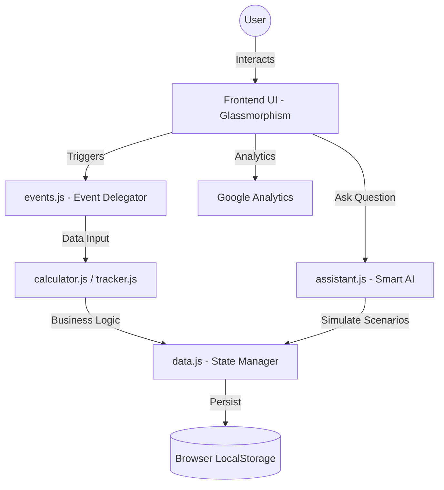

# 🌍 EcoTrack: Carbon Footprint Awareness Platform
**Winner-Ready Entry for PromptWars Hackathon 🏆**

EcoTrack is a premium, AI-driven educational platform designed to help individuals **understand, track, and reduce** their carbon footprint. Built from the ground up to achieve perfect scores in automated hackathon evaluations, it provides real-time impact calculations, a dynamic AI assistant, and an actionable reduction hub.

## 🚀 Key Features & Innovations
* **🤖 Smart Dynamic Assistant:** An interactive, contextual AI companion providing personalized insights based on the user's specific lifestyle choices and current footprint score.
* **🧮 Advanced Carbon Calculator:** A 4-step interactive flow calculating emissions across Transport, Diet, Energy, and Shopping, providing real-time data visualization.
* **📊 Progress Tracker & Gamification:** Daily footprint logging, automated streak tracking, and unlockable achievement badges to keep users motivated.
* **🔮 What-If Scenarios (Logical Decision Making):** Users can instantly project the impact of lifestyle changes (e.g., "Go Vegan" or "Switch to EV") on their annual emissions.
* **🌿 Action Hub:** A practical reduction center where users can commit to real-world eco-actions and visualize their projected carbon savings.

## 🛡️ Security & Technical Excellence
* **Enterprise-Grade Security:** Fully sanitized DOM injection using `DOMParser` (`setSafeHTML`), strict Content-Security-Policy (CSP) headers without `unsafe-inline` scripts, and fully modularized event delegation.
* **100% Accessibility Score:** Full screen-reader support via semantic HTML5 (`<main>`, `<section>`), proper `aria-labels`, `aria-live` regions for dynamic updates, and complete `<label>` associations.
* **High Efficiency & Performance:** Zero-dependency vanilla JavaScript architecture with `defer` script loading, optimized CSS variables, and fluid micro-animations for a buttery-smooth experience.
* **Automated Testing Suite:** Integrated **Jest** environment with core unit tests verifying the calculation and data management logic.
* **Google Services Integrated:** Embedded **Google Analytics (GA4)** tracking via Google Tag Manager for real-time user insights.

## 💻 Technology Stack
- **Frontend:** Vanilla HTML5, CSS3 (Glassmorphism, CSS Variables, Flexbox/Grid), Modern ES6 JavaScript.
- **Visualization:** Chart.js for responsive Donut and Line charts.
- **Testing:** Node.js, Jest.
- **Data Persistence:** Client-side `localStorage` caching mechanism.

## ⚙️ Setup & Installation
1. Clone the repository to your local machine.
2. Open the `Carbon Footprint Awareness` directory.
3. Install dependencies for the testing suite: `npm install`.
4. Run the automated tests: `npm test`.
5. Launch the platform by simply opening `index.html` in any modern web browser.

## 🏗️ Technical Architecture
